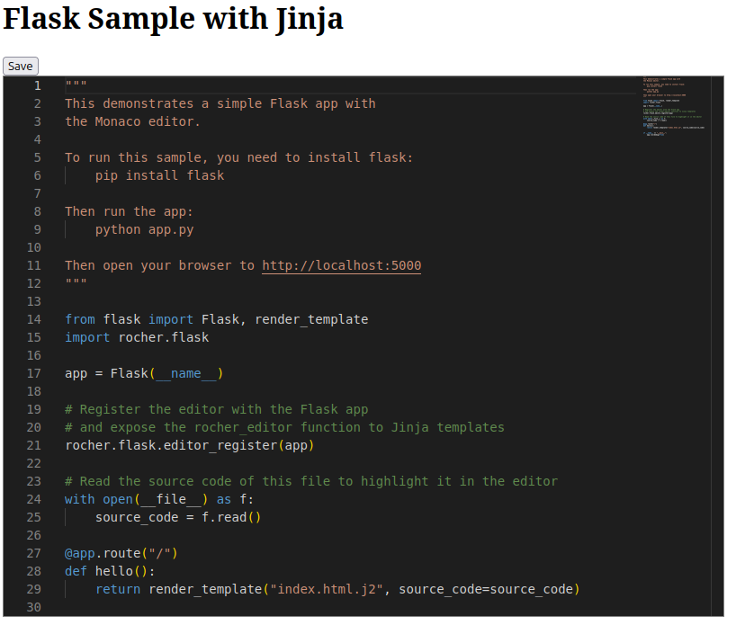

# Rocher

<a href="https://pypi.python.org/pypi/rocher"></a>

Rocher is a Python package for the Monaco code editor. The Monaco Editor is the code editor that powers Visual Studio Code. It provides a prebuilt version of the editor as a Python package, allowing you to embed it into any Python application as a standard Python package.



## Installation

```bash
pip install rocher
```

## Usage

See the [samples/](Samples) folder for more examples to use it with multiple frameworks.

### Path

The package provides only a function path():
    
```python   
import rocher

rocher.path()
```

This is the path where the Monaco editor is installed. You can serve after this path with your favorite Python web framework as a static folder.

### Editor HTML

The package provides a editor_html():

```python
import rocher

rocher.editor_html(
    "/static/vs",
    "container",
    "python",
    "print('Hello World!')",
)
```

This function will return a HTML string that you can embed in your web page. The first parameter is the path where the Monaco editor is exposed. The second parameter is the id of the HTML element where the editor will be embedded. The third parameter is the language of the editor. The fourth parameter is the initial content of the editor.

### Colorizer

The package also a simple syntax highlighter:

```python
import rocher

rocher.colorize_html("container")
```

This function will return a HTML string that you can embed in your web page. The first parameter is the id of the HTML element where the content will be highlighted.


### Flask

The package provide an helper for Flask + Jinja2:

```python

First you need to register the editor

```python
from flask import Flask
import rocher.flask

app = Flask(__name__)

rocher.editor_register(app)
```
    
Then you can use the editor in your template:
    
```django
<div id="container" style="width:800px;height:600px;border:1px solid grey"></div>
{{
    rocher_editor(
        "container",
        "python",
        source_code,
        readOnly=true,
        theme="vs-dark",
        lineHeight=20
    )
}}
```

All supported options are listed here: https://microsoft.github.io/monaco-editor/docs.html#interfaces/editor.IStandaloneEditorConstructionOptions.html


Or the colorizer:

```django
{{ rocher_colorize("code", initialize=False) }}

<h2>Python</h2>
<pre id="code" data-lang="python" style="width: 500px">
print("Hello World!")
</pre>
```

## Why the name Rocher?

Le Rocher is the hill where the Principality of Monaco is built. 

## Versioning

Following semantic versioning convention the major and version number of this package is the version of the Monaco Editor. The patch number is use to release a version of this package independent of the Monaco Editor version.

## Update the Monaco Editor

Edit update_editor.sh and change the version number. Then run the script. It will download the new version of the Monaco editor and update the package.

And run:    
```bash
hatch build -t sdist 
```
To build the packaged version.

## I can't find the Monaco Editor source code in the repository

The Monaco Editor is not part of this repository. It is downloaded from the official repository during the build process. See the update_editor.sh script.


## License

Licensed under the MIT License, see [LICENSE](LICENSE) for more information.

## Credits

All credit goes to the Monaco Editor team. This package is just a wrapper around their work.